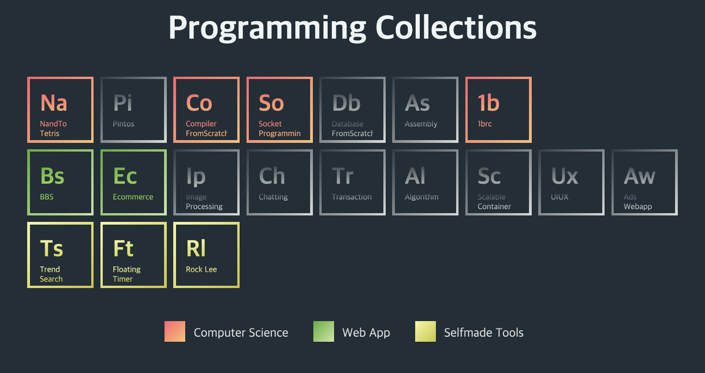

<!--  -->

<!--  -->

<!--  -->

- projects
    1. domain
        - [ecommerce](https://github.com/Doohwancho/ecommerce)
    2. productivity_tool
        1. [floating_timer](https://github.com/Doohwancho/floating_timer/) (ios)
        2. [skilltree](https://github.com/doohwancho/skilltree)(web)
        3. [time_ledger](https://github.com/doohwancho/time_ledger) (web)
        4. [RockLee](https://github.com/doohwancho/rocklee) (chrome extension)
        5. [repo_compare](https://github.com/doohwancho/repo_compare) (chrome extension)
    3. fun
        - [TrendSearch](https://github.com/doohwancho/trendsearch) (crawler)
    <!-- 4. from scratch -->
    <!--     - [stl from scratch.c](https://github.com/Doohwancho/computer-science/tree/main/01.c/04.stl) -->
    <!--     - [text editor from scratch.c](https://github.com/Doohwancho/computer-science/tree/main/01.c/05.project/04.text-editor) -->
    <!--     - math lib from scratch -->
    <!-- 4. personalization -->
    <!--     - ai -->
    <!--         - mbti + big5 + enneagram + ads -->
    <!--     - webgpu -->
    <!--         - virtual premium personal home page -->
    <!--         - virtual 3d rendering on web -->
    <!--     - FE -->
    <!--         - songforyou -->
    <!-- 5. tagging -->
    <!--     - webtoon -> 더 자세한 태그 구분 -->
    <!--     - problem solving competition platform -->
- 기본기
    - [computer science](https://github.com/Doohwancho/computer-science)
    - [java](https://github.com/Doohwancho/spring)
    - [javascript](https://github.com/Doohwancho/javascript)
    - [database](https://github.com/Doohwancho/database)
    - [devops](https://github.com/Doohwancho/devops)
    - [android](https://github.com/Doohwancho/android)
    - [swift](https://github.com/Doohwancho/swift)
    <!-- - [python](https://github.com/Doohwancho/python) -->
    - [leetcode](https://github.com/Doohwancho/leetcode)
